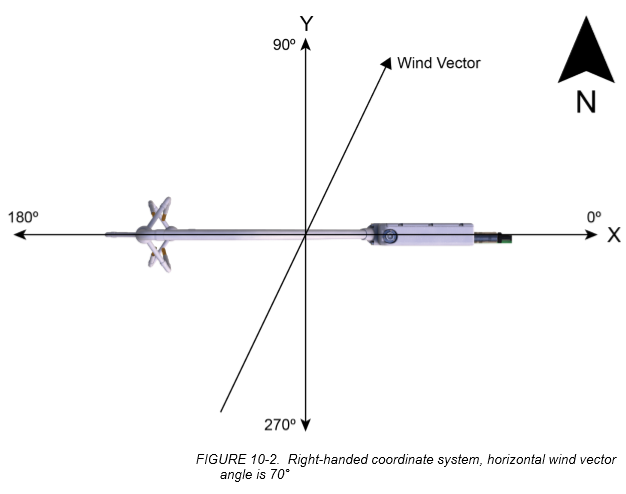
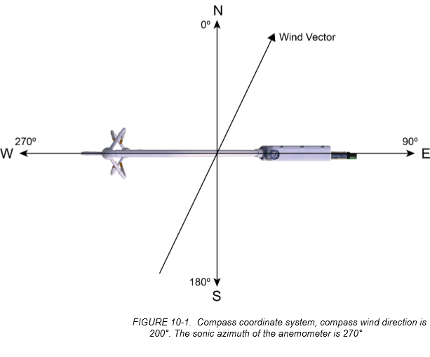
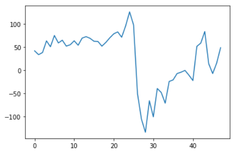
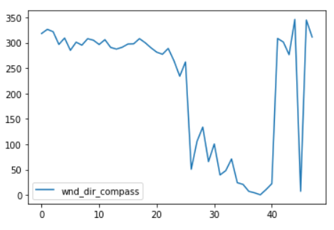
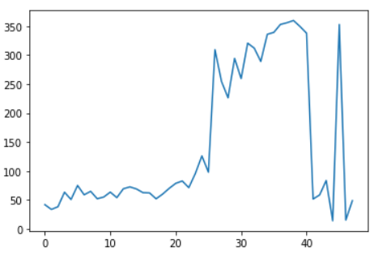
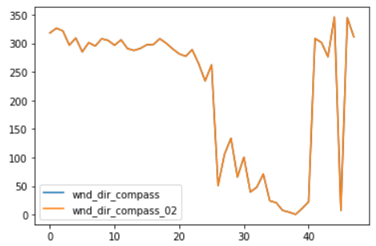
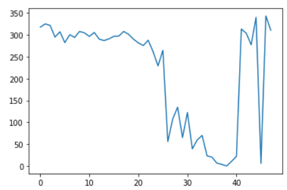
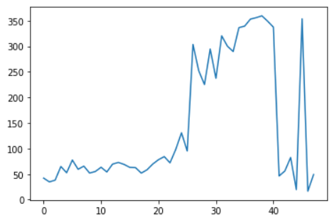
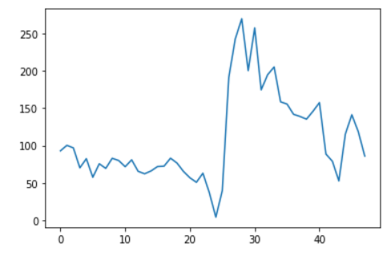

# Direção do vento

***Objetivo: Explicar como foi realizado a transformação de direção do vento.***

### 1. Situação inicial

Existem ***3*** tipos de arquivo e o código do Datalogger.
- TOA5_11341.flux.dat
    - SO-316736.cr3 (código do Datalogger)
- Full Output do EasyFlux
- Full Output do EddyPro

### 2. Variáveis de cada arquivo relativo à direção do vento

#### 2.1 TOA5_11341.flux.data
- wnd_spd
> Velocidade do vento
- rslt_wnd_spd
> Velocidade do vento sem considerar a Uz
- wind_dir_sonic
> Direção do vento relativo ao anemômetro
- wnd_dir_compass
> Direção do vento relativo à Terra

#### 2.2 Full Output do EasyFlux e Full Output do EddyPro
- wind_speed
> Velocidade do vento
- wind_dir
> Direção do vento relativo à Terra
    >> Porém seria preciso colocar o azimute .

### 3. Problema

Não foi adicionado o azimute no processamento no EddyPro e EasyFlux, logo, a direção do vento não representa o Norte nem o "Norte" do equipamento.

### 4. Solução

- Explorar quais fórmulas são utilizadas pelos programas para chegar no **wind_dir,  wind_dir_sonic e wind_dir_compass**.
- Reverter a direção do vento da forma **wind_dir** para **wind_dir_sonic**.
    - Para que seja determinado o "Norte" do equipamento.
- Adicionar o azimute no **wind_dir_sonic**
- Ajustar sentido de rotação do **wind_dir_sonic** e o **wind_dir_compass**
    - O **wind_dir_sonic** é no sentido **anti-horário**. 
    - O **wind_dir_compass** é no sentido **horário**. 

#### 4.1 Exploração das fórmulas e comparação de variáveis de diferentes Outputs

##### 4.1.1 Exploração do Código "SO-316736.cr3"

Linha 839-840:
```
'Rotate the CSAT3A sonic head RHC system so the negative x-axis points north.
wnd_dir_compass = (360+sonic_azimuth-wnd_dir_sonic) MOD 360
```
A variável wnd_dir_compass é calculada baseada na direção do azimute ("sonic_azimuth") e do "norte" relativo ao equipamento ("wnd_dir_sonic"). E em seguida parece que é utilizado uma função "MOD 360" para que valores maiores que 360 sejam reajustados para ficar entre 0° e 360°.

Linha 842-843:
```
'Make the CSAT3A sonic head wind direction fall between 0 to 180 degrees and 0 to -180 degrees.
If ( wnd_dir_sonic > 180 ) Then ( wnd_dir_sonic = wnd_dir_sonic-360 )
```
Em seguida, é transformado a variável "wnd_dir_sonic" para variar entre -180° até 180°.
> Eu não entendi o motivo de realizar essa transformação. No estudo de caso será necessário realizar a transformação de 0° até 360°.

##### 4.1.2 Estudo de caso dos Outputs

Primeiramente foi utilizados dados processados de mesmo período para permitir comparação.

Foi então criado 3 DataFrames para cada output e em seguida escolhido uma data específica para realizar as comparações de direção do vento.

```python
# DataFrame do Lowfreq (Datalogger)
df_lf = pd.read_csv(file_lf, skiprows=[0,2,3], parse_dates=['TIMESTAMP'])
# Subset do LowFreq com a data específica
wind_dir_lf = df_lf.loc[df_lf['TIMESTAMP'].dt.date==dt.date(2019,3,30), ['TIMESTAMP','wnd_dir_sonic','wnd_dir_compass','wnd_spd']].reset_index()

# DataFrame do FullOutput do EddyPro
df_ep = pd.read_csv(file_ep, skiprows=[0,2], parse_dates={'TIMESTAMP':['date','time']})
# Subset do FullOutput do EddyPro com data específica
wind_dir_ep = df_ep.loc[df_ep['TIMESTAMP'].dt.date==dt.date(2019,3,30), ['TIMESTAMP','wind_dir','wind_speed']].reset_index()

# DataFrame do FullOutput do EasyFlux
df_ef = pd.read_csv(file_ef, skiprows=[0,2], parse_dates={'TIMESTAMP':['date','time']})
```

Visualizando o estado inicial das variáveis, começando com o do **LowFreq (Datalogger)**

```python
wind_dir_lf['wnd_dir_sonic'].plot()
```
Podemos observar que realmente a direção do vento varia entre -180° e 180°.



```python
(wind_dir_lf['wnd_dir_compass']).plot(legend='wnd_dir_compass')
```
A variável "wind_dir_compass" varia de 0° até 360°, se voltarmos no código do "SO-316736.cr3", podemos observar que essa variável é definida antes da realização da troca.




Também observando o código .cr3 é observado que:
```
wnd_dir_compass = 360 + sonic_azimuth - wnd_dir_sonic
```
Porém, o "sonic_azimuth" é igual a ZERO. Então... o "wnd_dir_compass" não representa o Norte, porém, ele é somente 360 - "wnd_dir_sonic". Sendo que, "wnd_dir_sonic" varia de 0° até 360°, ao invéz de -180° até 180°. Desta forma é preciso retornar "wnd_dir_sonic" para a sua forma inicial.

```python
# Criação de uma coluna para o novo wnd_dir_sonic
wind_dir_lf['wnd_dir_sonic_01'] = wind_dir_lf['wnd_dir_sonic']

# Aplicação de uma função a para somar 360 se o valor de "wnd_dir_sonic_01" ser menor que zero, e caso x seja maior que zero manter o valor
wind_dir_lf['wnd_dir_sonic_01'] = wind_dir_lf['wnd_dir_sonic_01'].apply(lambda x: x+360 if x<0 else x)
```
O código acima reverte o "wnd_dir_sonic" que varia de -180° até 180° para variar entre 0° e 360°.

```python
wind_dir_lf['wnd_dir_sonic_01'].plot()
```



Com esse novo "wnd_dir_sonic", agora, podemos utiliza-lo para a transformação de um novo "wnd_dir_compass". Lembremos da fórmula de acordo com o código .cr3 (wnd_dir_compass = 360 + sonic_azimuth - wnd_dir_sonic).


```python
# Novo wnd_dir_compass, porém, ainda o azimute está como zero.
wind_dir_lf['wnd_dir_compass_02'] = 360 - wind_dir_lf['wnd_dir_sonic_01']
```
Observa-se que o azimute ainda está igual a **zero**, no entanto, essa escolha (até o momento) foi para que seja possível a comparação entre o obtido direto do datalogger/código e verificação de cálculo.

```python
wind_dir_lf['wnd_dir_compass'].plot(legend='')
wind_dir_lf['wnd_dir_compass_02'].plot(legend='')
```


Observa-se que ambos estão sobrepostos, logo, o cálculo está seguindo o código.

Os passos anteriores foram realizados utilizando o arquivo LowFreq (Datalogger), a qual é gerado uma variável "wnd_dir_sonic" e "wnd_dir_compass". Porém, tanto o FullOutput do EasyFlux e EddyPro é gerado somente um tipo de direção ("wind_dir"). E esse "wind_dir" seria na realidade a direção do vento relativo a Terra ou "wnd_dir_compass".


```python
wind_dir_ep['wind_dir'].plot()
```


Assim, "wind_dir" do EddyPro e EasyFlux é igual ao "wind_dir_compass" do LowFreq(Datalogger). **Ambos errados por não considerar o azimute**.

```python
wind_dir_ep['wind_dir_sonic'] = 360 - wind_dir_ep['wind_dir']
wind_dir_ep['wind_dir_sonic'].plot()
```


Observa-se que o "wind_dir_sonic" do EddyPro está igual ao "wnd_dir_sonic_01" do LowFreq (DataLogger). Assim, encontramos a direção do vento relativo ao equipamento. Agora é necessário transformar para que considere o azimute.


```python
azimute = 156-20.9

# Aplicado a equação igual ao do código .cr3
wind_dir_ep['wind_dir_compass_01'] = (360 + azimute - wind_dir_ep['wind_dir_sonic']).apply(lambda x: x-360 if x>=360 else x)

#Plot
wind_dir_ep['wind_dir_compass_01'].plot()
```



Enfim, corrigido a direção do vento para o Norte.

#### Pontos Importantes
- wind_dir_compass = (360 + azimute - wind_dir_sonic) MOD 360
    - Quando você coloca 360 - wind_dir_sonic, você na realidade está alterando o sentido de rotação.
    > 'wind_dir_sonic' é anti-horário

    >  'wind_dir_compass' é horário
